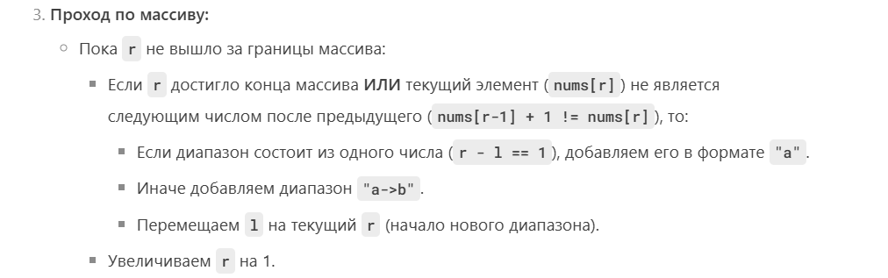

# ДНЕВНИК РЕШЕНИЙ

> https://leetcode.com/problems/summary-ranges/description/

Код для оптимального решения + описание 

- зафиксировать правильное решение
- оценка по времени и памяти
- путь по которому вы пришли к решению


## Структура:

# 1. Решение



```kotlin
class Solution {
    fun summaryRanges(nums: IntArray): List<String> {
        if (nums.size == 1) return listOf("${nums[0]}")
        
        var result = mutableListOf<String>()        
        var l = 0
        var r = 1
            
        while (r <= nums.size) {            
            if (r == nums.size || nums[r-1] + 1 != nums[r]) {
                if (r - l == 1) result.add("${nums[l]}")
                else result.add("${nums[l]}->${nums[r-1]}")
                l=r
            }
            r++
        }
        
        return result
    }
}
```


```kotlin
class Solution {
    fun summaryRanges(nums: IntArray): List<String> {
        if (nums.isEmpty()) return emptyList()
        
        val result = mutableListOf<String>()
        var start = nums[0]

        for (i in 1 until nums.size) {
            // Если текущее число не продолжает последовательность
            if (nums[i] != nums[i - 1] + 1) {
                // Если диапазон из одного числа — добавляем "a"
                if (start == nums[i - 1]) {
                    result.add("$start")
                }
                // Иначе — "a->b"
                else {
                    result.add("$start->${nums[i - 1]}")
                }
                // Начинаем новый диапазон с текущего числа
                start = nums[i]
            }
        }

        // Добавляем последний диапазон
        if (start == nums.last()) {
            result.add("$start")
        } else {
            result.add("$start->${nums.last()}")
        }
        
        return result
    }
}
```


# 2. Оценка по времени


# 3. Оценка по памяти


# 4. Ваши объяснения


